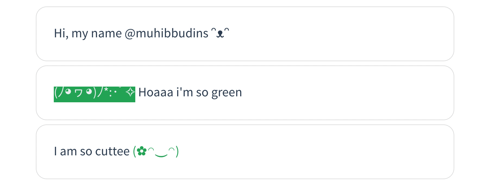

# Text Emotion

TextEmotion are library to create emotion text, using Vanilla JavaScript (without dependency required). We can create emotion like smile, sad and more (180+ emotion).

We use [KawaiiFace](https://kawaiiface.net/happy-kawaii-faces/) as text emotion dictionary.

- [Demo](/preview)
- [Face Dictionary](/face)
- [API Reference](/api)

### Getting Started

1. [Download](https://raw.githubusercontent.com/muhibbudins/text-emotion/master/dist/TextEmotion.min.js) latest version of TextEmotion
2. Include to your project
```html
<script src="path/to/TextEmotion.min.js" type="text/javascript"></script>
```
3. Run TextEmotion like [demo](/preview)

### Todo

- [x] Create base Emotion Dictionary
- [x] Create function to create face
- [x] Create function to animate face
- [x] Add option color and background
- [x] Change base Emotion Symbol to KawaiiFace
- [x] Create function inline replacer
- [x] Create documentation
- [ ] Implement animate on inline emotion

### Thanks To

Special thanks to [KawaiiFace](https://kawaiiface.net/happy-kawaii-faces/) as text emotion dictionary.

### License

This projects under MIT License